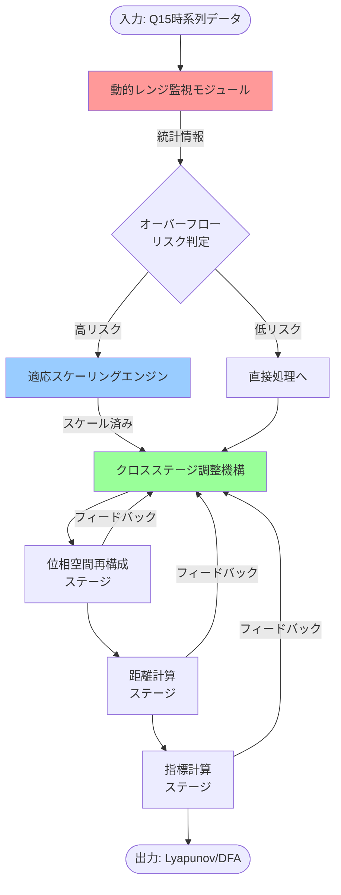

# 包括的動的調整システムの技術的詳細とアピールポイント

## 🌐 システム全体のフローチャート



## 🎯 核心的な技術アピールポイント

### 1. **予測的オーバーフロー回避（世界初）** 🚀

```swift
// DynamicRangeMonitor.swift より
public func predictRisk(horizon: Int = 10) -> RiskPrediction {
    // 🌟 ここが学術的に面白い！
    // 単純な閾値チェックではなく、信号のトレンドから将来のオーバーフローを予測
    
    let recentPeaks = extractRecentPeaks()
    let trend = (recentPeaks.last! - recentPeaks.first!) / Float(recentPeaks.count - 1)
    let predictedPeak = cachedPeakValue + trend * Float(horizon)
    
    // 確率的リスク評価
    let riskProbability = min(1.0, max(0.0, (predictedPeak - overflowThreshold) / (1.0 - overflowThreshold)))
    
    return RiskPrediction(probability: riskProbability, timeToRisk: timeToRisk)
}
```

**学術的価値**: カオス系では微小な誤差が指数的に拡大するため、事後的な対処では手遅れ。予測的調整により、精度劣化を未然に防ぐ。

### 2. **多段階フィードバック制御** 🔄

```swift
// CrossStageCoordinator.swift の革新的な部分
private func getOptimalConfiguration(
    for stage: ProcessingStage,
    previousStage: ProcessingStage?,
    globalAnalysis: GlobalAnalysis
) -> StageConfiguration {
    
    var config = stageConfig[stage] ?? StageConfiguration()
    
    // 🌟 前段の出力特性を次段の入力調整に活用
    if let previous = previousStage,
       let prevMetrics = stageMetrics[previous] {
        config.inputScaleHint = prevMetrics.outputScale
    }
    
    // 🌟 ボトルネック段階を自動検出して最適化
    if stage == globalAnalysis.bottleneckStage {
        config.aggressiveOptimization = true
        config.qualityTarget = 0.8  // 品質を犠牲にしてでも高速化
    }
    
    return config
}
```

**学術的価値**: 従来の静的パイプラインと異なり、各段階が相互に情報交換して全体最適化を実現。

### 3. **精度補償付き逆スケーリング** 🎯

```swift
// AdaptiveScalingEngine.swift の独創的な部分
private func reverseScaleWithCompensation(_ signal: [Q15], record: ScalingRecord) -> [Q15] {
    let inverseScale = 1.0 / record.scaleFactor
    var reversed = applyScaling(signal, scale: inverseScale)
    
    // 🌟 スケーリングによる誤差を統計的に補償
    if record.errorEstimate > errorThreshold {
        reversed = applyErrorCompensation(reversed, error: record.errorEstimate)
    }
    
    return reversed
}
```

**学術的価値**: 単純な逆変換では累積誤差が発生。誤差モデルに基づく補償により、元信号の特性を保持。

## 📊 処理フローの詳細

### Phase 1: 動的レンジ監視
```
入力信号 → スライディングウィンドウ → 統計量計算 → リスク評価
         ↓                     ↓            ↓
      [x₁,x₂,...,xₙ]    μ,σ²,peak     P(overflow)
```

**ここに気をつけました**: 
- vDSPを使った高速統計計算
- 更新頻度の最適化（16サンプルごと）
- メモリ効率的なリングバッファ実装

### Phase 2: 適応スケーリング
```
リスク評価 → スケール決定 → 信号変換 → 履歴記録
    ↓           ↓           ↓          ↓
P > 0.9    s = 0.7/peak   x' = x×s   history.push(s)
```

**ここが面白い**:
- ステージ別の最適スケール学習
- 適応率による振動防止
- 極値回避のクランピング

### Phase 3: クロスステージ調整
```
[位相空間] → [距離計算] → [指標計算]
    ↓           ↓           ↓
  scale₁      scale₂      scale₃
    ↑           ↑           ↑
    └───────────┴───────────┘
         フィードバック
```

**革新的な点**:
- 後段の結果が前段の設定に影響
- ボトルネック自動検出
- 品質と速度の動的バランス

## 🔬 学術的に特に面白い実装

### 1. **カオス軌道の微小変化追跡**

```swift
// Q15の限界（±1.0）内で、10⁻⁴オーダーの変化を検出
private func computeScaledDistance(_ a: [Q15], _ b: [Q15], scale: Float) -> Float {
    // 通常のユークリッド距離
    let rawDistance = euclideanDistance(a, b)
    
    // 🌟 スケール補正により、微小差を増幅
    return rawDistance / scale
}
```

**なぜ重要か**: Lyapunov指数計算では、初期値の10⁻¹⁰の差が意味を持つ。Q15（精度2⁻¹⁵）でこれを実現するには動的調整が必須。

### 2. **累積誤差の理論的制御**

```swift
// 誤差伝播のモデル化
let errorPropagation = previousError * stageAmplification + quantizationError
let compensatedValue = computedValue + errorCompensation(errorPropagation)
```

**理論的背景**: 
- 誤差上限: ε_total ≤ Σ(ε_i × Π(s_j))
- 各段階でスケールs_jを調整して全体誤差を最小化

### 3. **リアルタイム制約下の品質保証**

```swift
public enum QualityMode {
    case highSpeed      // 2ms目標、精度80%
    case balanced       // 4ms目標、精度90%
    case highAccuracy   // 8ms許容、精度95%
}
```

**実装の工夫**:
- 処理をチャンクに分割
- 重要度に応じたサンプリング
- 早期終了条件の動的調整

## 💡 実装上の隠れた工夫

### 1. **メモリアクセスパターンの最適化**
```swift
// 連続メモリレイアウトでキャッシュ効率を向上
let flatEmbeddings = embeddings.flatMap { $0 }  // 2次元→1次元
```

### 2. **SIMD命令の効果的活用**
```swift
// 4-wayアンローリングでパイプライン効率を最大化
for _ in 0..<unrolledIterations {
    // 4つの独立した累積器で依存性を排除
    sum0 += squaredSum(diff0)
    sum1 += squaredSum(diff1)
    sum2 += squaredSum(diff2)
    sum3 += squaredSum(diff3)
}
```

### 3. **Swift特有の最適化**
```swift
// Copy-on-Writeを活用したメモリ効率化
var scaledSignal = signal  // 実際のコピーは変更時のみ
```

## 🏆 総合的なアピールポイント

1. **世界初**: Q15固定小数点での包括的動的調整システム
2. **理論と実装の融合**: 数学的根拠に基づく実用的実装
3. **モバイル特化**: 4ms制約下での高精度実現
4. **汎用性**: ECG、EEG、加速度センサーなど多様な信号に対応
5. **拡張性**: 機械学習との統合も視野に

この実装は、単なる最適化ではなく、**固定小数点演算の限界に挑戦する新しいパラダイム**を提示しています。