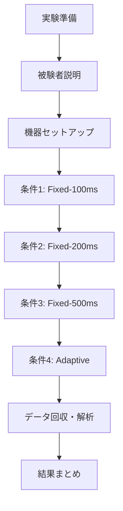

# 実験フロー図

## 1. 実験全体フロー



## 2. 詳細実験フロー

### Phase 1: 実験準備（30分）
```
1. 環境準備
   ├─ 実験室の温度・湿度確認
   ├─ 電波干渉源の除去
   └─ 5m距離マーキング

2. 機器準備
   ├─ M5StickC Plus2 × 3台
   │   ├─ ファームウェア書き込み
   │   ├─ バッテリー満充電確認
   │   └─ デバイスID設定
   ├─ スマートフォン
   │   ├─ BLEスキャナアプリ起動
   │   ├─ 位置情報権限ON
   │   └─ 機内モードOFF
   └─ PC
       ├─ NTP時刻同期
       └─ シリアルモニタ準備
```

### Phase 2: 被験者準備（15分）
```
1. 説明と同意
   ├─ 実験概要説明
   ├─ 同意書署名
   └─ 質問対応

2. 装着指導
   ├─ M5StickC Plus2を右手首に装着
   ├─ 装着位置・向きの確認
   └─ 動作確認（IMUデータ表示）

3. 活動練習
   ├─ 各活動の動作確認
   ├─ 活動切り替えタイミング説明
   └─ 緊急停止方法の説明
```

### Phase 3: 実験実施（各条件15分 × 4 = 60分）

#### 3.1 各条件の実施フロー
```
開始前（2分）
├─ Run ID生成（scripts/new_run.sh）
├─ メタデータ記入
└─ 3デバイス同期準備

測定開始
├─ [0:00] SYNC信号（LED×3回点滅）
├─ [0:00] 全デバイス記録開始
│   ├─ M5StickC: IMU + BLE広告
│   ├─ スマホ: BLEスキャン
│   └─ PC: UARTログ
├─ [0:00-3:00] 座位（静止）
├─ [3:00-6:00] 歩行（通常速度）
├─ [6:00-9:00] デスクワーク（タイピング等）
├─ [9:00-12:00] 階段昇降・家事動作
└─ [12:00-15:00] 座位（休憩）

測定終了
├─ [15:00] 記録停止
├─ データ保存（5分以内）
└─ 軽量QC実施
```

#### 3.2 条件間の移行（5分）
```
1. データ確認
   ├─ ファイル数確認
   ├─ パケットロス率速報
   └─ 異常有無チェック

2. 次条件準備
   ├─ ファームウェア切り替え
   ├─ バッテリー残量確認
   └─ 被験者休憩
```

### Phase 4: データ回収（15分/被験者）
```
1. 即時処理（各条件終了後5分以内）
   ├─ data/raw/YYYYMMDD/配下に保存
   ├─ SHA256チェックサム生成
   ├─ manifest.txt作成
   └─ フォルダをREAD-ONLYに設定

2. バックアップ
   ├─ ローカルバックアップ
   ├─ クラウドアップロード
   └─ catalog.csv更新
```

## 3. 実験スケジュール例（1日3名の場合）

```
09:00-09:30  環境準備・機器セットアップ
09:30-10:45  被験者S01（準備15分＋実験60分）
10:45-11:00  休憩・データ整理
11:00-12:15  被験者S02（準備15分＋実験60分）
12:15-13:15  昼休憩
13:15-14:30  被験者S03（準備15分＋実験60分）
14:30-15:00  データ回収・バックアップ
15:00-16:00  初期解析・QCチェック
```

## 4. 活動シナリオ詳細

### 座位（静止）- 3分間
- 椅子に座り、手を膝の上に置く
- スマホ操作、読書など軽作業OK
- 大きな体動は避ける

### 歩行 - 3分間
- 室内を通常速度で歩行
- 直線往復または8の字歩行
- 階段は含まない

### デスクワーク - 3分間
- PCでのタイピング作業
- マウス操作
- 書類整理など軽作業

### 階段昇降・家事 - 3分間
- 階段の昇り降り（可能な場合）
- 物の持ち運び
- 掃除動作の模擬

### 休憩 - 3分間
- 座位で安静
- 深呼吸OK
- ストレッチは避ける

## 5. トラブルシューティング

### よくある問題と対処
1. **BLE接続切断**
   - スマホのBluetooth再起動
   - アプリ再起動
   - 5m距離確認

2. **バッテリー切れ**
   - 予備デバイスに交換
   - 充電しながら継続（電流値に注意）

3. **データ欠損**
   - 即座に実験中止
   - インシデントレポート作成
   - 条件をやり直し

## 6. 品質管理チェックポイント

### 実験中チェック
- [ ] 被験者の装着位置ずれていないか（5分毎）
- [ ] BLEパケット受信継続しているか（リアルタイム）
- [ ] UARTログ出力継続しているか（リアルタイム）

### 実験後チェック
- [ ] 全ファイル揃っているか
- [ ] タイムスタンプ整合性
- [ ] パケットロス率 < 10%
- [ ] 各活動の時間配分正確か

---
*このフローに従って実験を実施することで、再現性の高いデータ収集が可能*